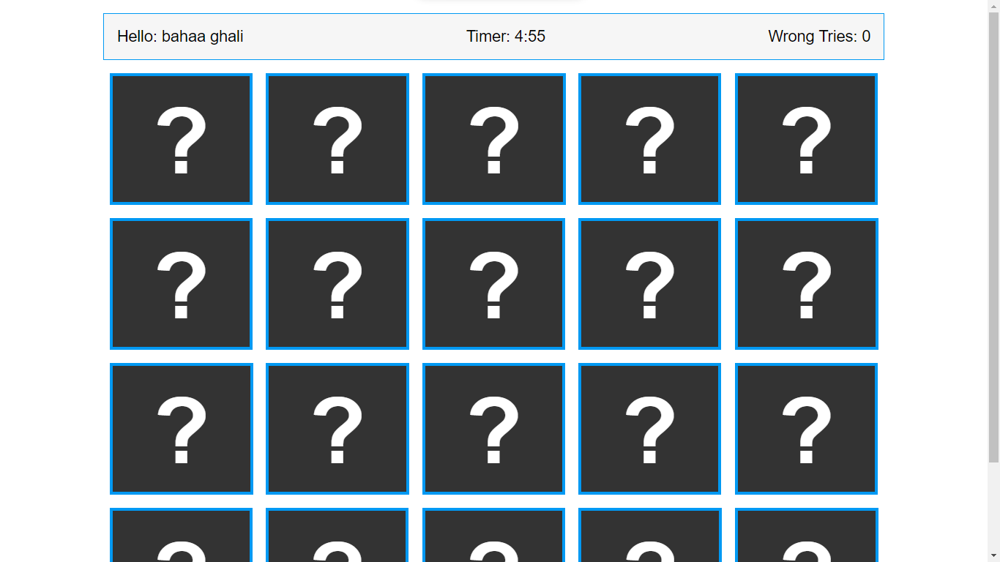

# Memory Game

The <a href="https://memory-game-bahaaghali000.onrender.com/">Memory Game</a> is a web-based game designed to test the player's memory retention skills. It is built entirely using HTML, CSS, and JavaScript, making it lightweight and easy to run in any modern web browser.

<a href="https://memory-game-bahaaghali000.onrender.com/"><strong>Live Demo</strong></a>

# How To Play

The game consists of a grid of cards, with each card featuring a unique symbol. The player's objective is to match all pairs of cards as quickly as possible with a maximum of 5 tries. To do this, they can click on two cards to reveal their symbols. If the symbols match, the cards will remain face-up, and the player can move on to the next pair. If the symbols do not match, the cards will be flipped back over, and the player must try again. If the player exceeds the maximum number of tries, the game will end, and the player will receive their final score.

The game ends when all pairs have been matched or when the timer of 5 minutes runs out.

# Features

<ul>
    <li>Easy to use and intuitive interface</li>
    <li>Randomized card layouts for endless replayability</li>
    <li>Timer to track the player's progress</li>
    <li>Fun and engaging sound effects to enhance the gaming experience</li>
</ul>
